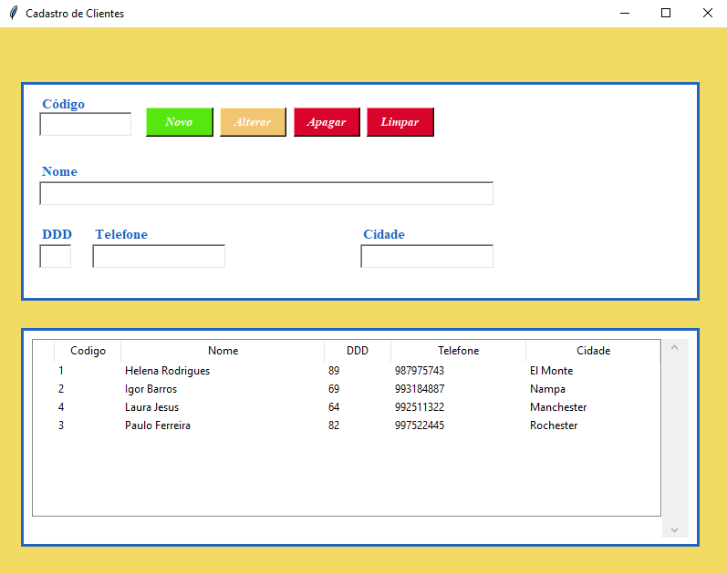
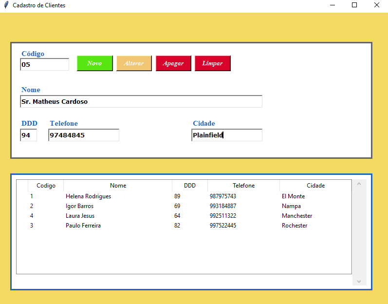
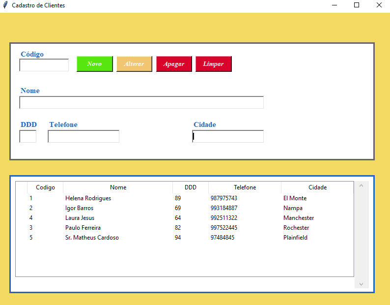
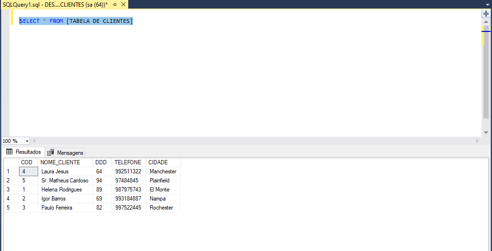
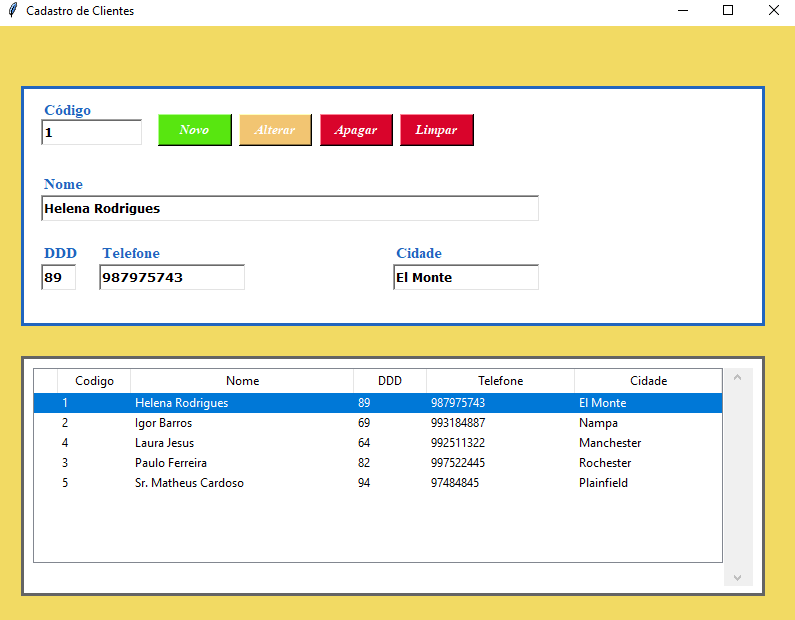
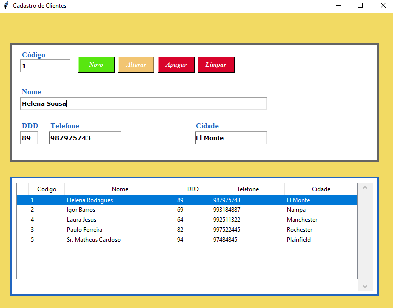
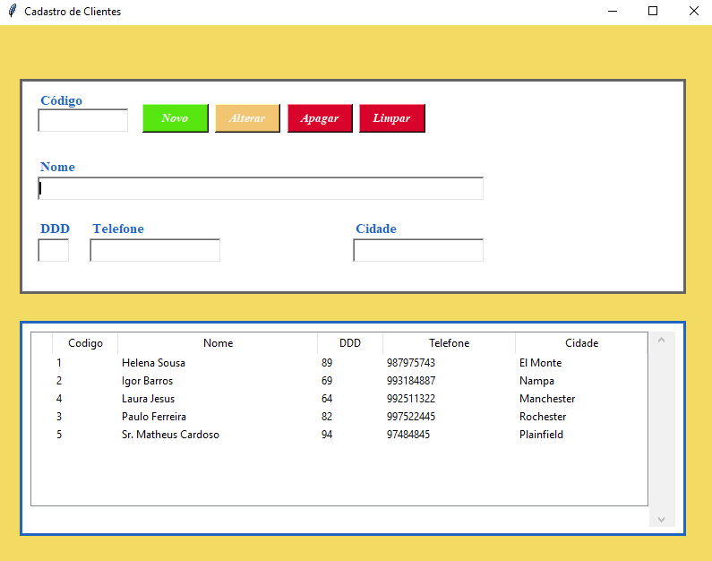
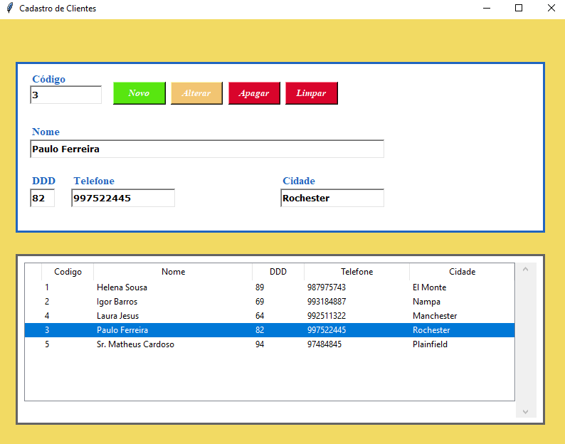
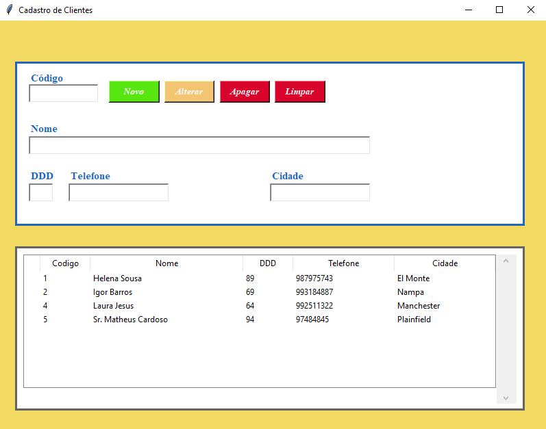

# **PROGRAMA PARA CADASTRO DE CLIENTES**

Programa simples para cadastro de clientes, usando as bibliotecas: **tkinter** e **pyodbc**.
Junto com essas bibliotecas fiz a integração com o banco de dados, SQL Server.

**Resumindo:** \
Fiz um "CRUD" de uma forma bem simples. 

# **Bibliotecas principais:**
* Tkinter - https://docs.python.org/3/library/tkinter.html
* pyodbc - https://pypi.org/project/pyodbc/

# **Banco de dados principal:**
* SQL Server

# **EXECUTANDO O PROGRAMA:**

**Primeiro passo, execute o programa.**

Na tela do programa temos botão **novo**, **alterar**, **apagar** e **limpar**. O que esses botões fazem?

* Novo - Adiciona um novo cliente no banco de dados.
* Alterar - Altera o registro em nosso banco de dados.
* Apagar - Exclui o registro do nosso banco de dados.
* Limpar - Limpa os campos **código**, **nome**, **ddd**, **telefone** e **cidade**.

**Segundo passo, vamos adicionar um novo cliente.**

Vamos escrever os dados do cliente:

Colocando os dados do cliente, aperte em **novo**.

Você pode perceber que adicionamos o **"Sr. Matheus Cardoso"** ao final da lista.

Podemos até dar uma olhada em nosso **SQL**:

**Terceiro passo, vamos alterar um cliente.**

Como vamos fazer isso? Vamos selecionar a nossa cliente **"Helena Rodrigues"**, dando um **duplo clique** nela. Perceba que ela voltou **automaticamente** para a **tela de registro**.

Trocaremos o **sobrenome** dela, vamos colocar **"Sousa"**.
Agora vamos clicar em nosso **botão alterar** e vai ser **atualizado**
na **lista/banco de dados** .

Quando olharmos em nossa **lista/banco de dados**, podemos ver que foi **alterado**.

**Quarto passo, vamos apagar um cliente.**

Para **deletar** um cliente é bem simples. Vamos **selecionar ele novamente**, dando um **duplo clique** nele.

Vamos usar de **exemplo** o cliente **"Paulo Ferreira"**.

Podemos observar que ele foi **deletado** da nossa **lista/banco de dados**.

Espero que tenha gostado = )!